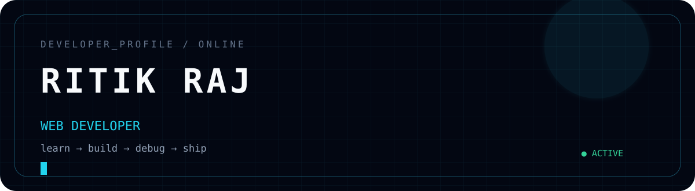

<div align="center">



### `RITIK RAJ`

**Web Developer in Progress · Builder · Learner**

[GitHub](https://github.com/ritikraj-cg) · [Repositories](https://github.com/ritikraj-cg?tab=repositories)

</div>


## `01` — About Me

Hi, I'm **Ritik Raj**.

I'm learning web development by building projects instead of only following tutorials. My current journey is focused on creating clean interfaces, understanding how the web works, and becoming better at writing and organizing code.

```text
$ whoami
ritikraj-cg

$ current_mode
LEARNING + BUILDING

$ philosophy
learn → build → debug → improve → repeat
```

## `02` — What I'm Learning

| Area | Focus |
|---|---|
| 🌐 Web | HTML · CSS · JavaScript |
| 🐍 Programming | Python |
| 🔧 Workflow | Git · GitHub · VS Code |
| 🎨 Frontend | Responsive UI · Layout · Animation |
| 🚀 Practice | Daily projects and assignments |

## `03` — Current Stack

`HTML` `CSS` `JavaScript` `Python` `Git` `GitHub` `VS Code`


## `04` — Projects

### ☕ Coffee Website

A coffee-selling website concept focused on a distinctive visual design, user-friendly experience, and frontend animation.

**Built with:** `HTML` `CSS`

### 📚 Web Development Learning Journey

A collection of my daily HTML/CSS/JavaScript work as I progress from fundamentals toward real projects.

**Built with:** `HTML` `CSS` `JavaScript`

→ [Explore all repositories](https://github.com/ritikraj-cg?tab=repositories)

## `05` — My Development Loop

```text
┌─────────┐
│  LEARN  │
└────┬────┘
     ↓
┌─────────┐
│  BUILD  │
└────┬────┘
     ↓
┌─────────┐
│  DEBUG  │
└────┬────┘
     ↓
┌─────────┐
│ IMPROVE │
└────┬────┘
     ↓
┌─────────┐
│  SHIP   │
└────┬────┘
     │
     └──────────────→ REPEAT
```

## `06` — Goals

- Build stronger frontend fundamentals
- Become comfortable with JavaScript
- Build larger projects
- Improve UI/UX and animations
- Learn better Git/GitHub workflows
- Turn learning into a visible portfolio


<div align="center">

### `KEEP BUILDING.`

**Learning today. Building tomorrow.**

<br>

<a href="https://github.com/ritikraj-cg">github.com/ritikraj-cg</a>

</div>
